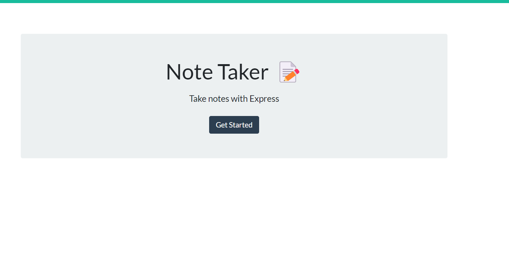

# Note Taker

## Description

The goal of this project was to troubleshoot code for a server that is designed to receive input from the user, save the input, and be accessible when the user would like to go back to view the saved information. We were originally provided the code for the main page along with the notes page. The first task that needed to be accomplished was reading through the code so we may better understand the outputs/inputs that have been provided. We were challenged by our teacher to not edit anything in the public folder so we may practice how to adjust our code to match existing code, this is because when we are in the work place we will often be put into situations where we must troubleshoot existing code and it is always best to not adjust code from the company. After reading the code we were tasked with creating the server.

It was tremendous practice and the lessons for the week were extremely applicable. Especially the lesson where we had to take existing information, put it in an array, and then access it again without overwriting the existing database. I was able to review the class recordings for that lesson and a few others which were incredibly helpful. I was able to practice my get requests, to access the public files provided. Practice how to append and add information to the json database, along with converting the strings into json for saving/retrieval. With the website now running users will be able to successfully saves notes and access them at a later time when needed. 

## Installation

If running through node/terminal, please begin by inputting npm i. This will help install the necessary packages to run the server. 

## Usage

You may also go directly to the deployed website as well at: 

## Credits

My classmates for pointing me in the direction of uuidv4, because I was stuck on how to create the unique ID for awhile with this project.
